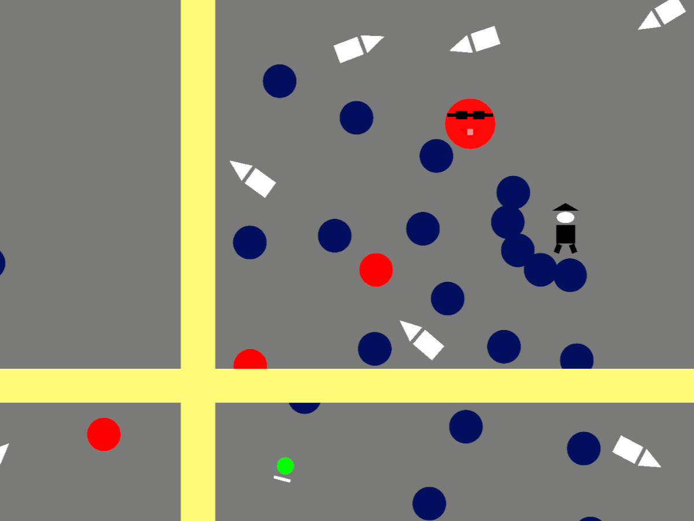

ゲーム制作技術総合実習 個人ワーク
（Circle, Triangle, Squareを使用した2Dゲーム）

# Break Face

## ゲームの内容
- 弾幕避けシューティング。
- 全方向から襲い掛かる弾幕を避けつつ、敵に攻撃を当て続けろ。
- フルスクリーン用に制作。（フルスクリーン意外だと画面が合わない可能性あり）

## 操作説明
- W,A,S,D : 上下左右に移動
- マウス左クリック : Shot
- マウスマウス右クリック : BreakShot (チャージがたまれば使える)
- マウス移動 : Aim移動
